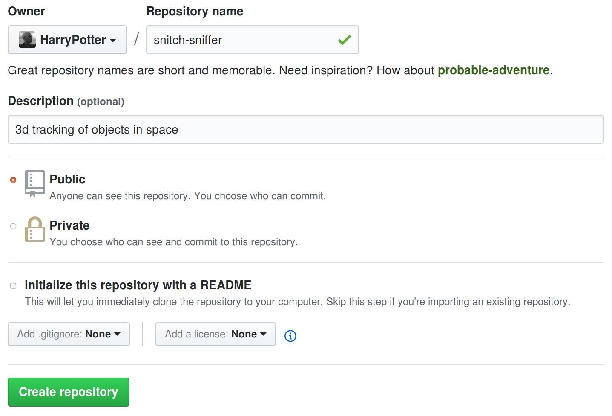
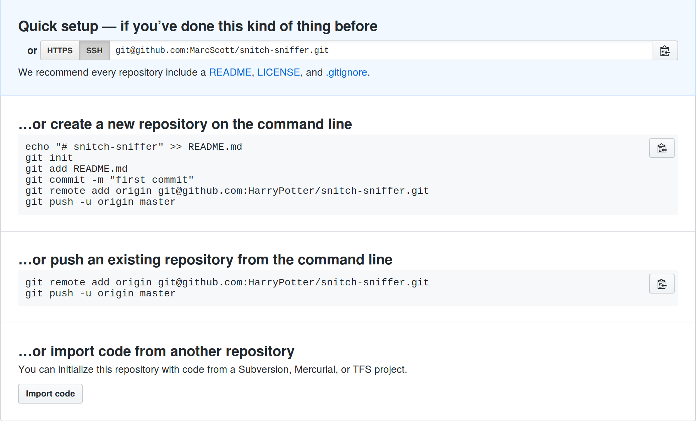
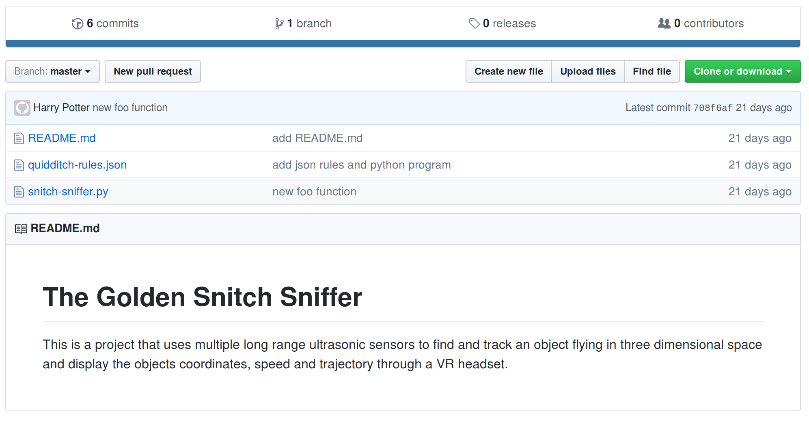

## Working with a sky-bag

Now that you know how to do the basics in Git, it's time to learn how to use it to its full potential: use it to share your work and collaborate with others.

There are lots of services that will host your Git repo for you, free of charge. [GitLab](https://about.gitlab.com/) is one such service and [BitBucket](https://bitbucket.org/) is another. In this resource, you are going to be using [GitHub](https://github.com/), which is one of the more popular services.

- The first thing to do is to register for an account on [GitHub](https://github.com/join?source=header-home), and just choose the free plan.

	

- Now that you have an account, you can create a `snitch-sniffer` repo on GitHub. Find the **New repository** button and click it.

	

- Give the repo a name and a description and click on the **Create repository** button

	

- This should then bring up a page of instructions

	

- As you already have a repo ready to push to GitHub, then all you need to do is make sure you are in your project directory and type:

	```bash
	git remote add origin git@github.com:HarryPotter/snitch-sniffer.git
	```

	and then

	```bash
	git push -u origin master
	```

- If you look on GitHub, you should now be able to see your repo, along with the displayed `README.md` file that you wrote.

	

- Any time you make changes to your project, and you want to push them up to GitHub, you can just type:

	```bash
	git push origin master
	```

	If you are working on a different branch you would type:

	```bash
	git push origin <branch-name>
	```

