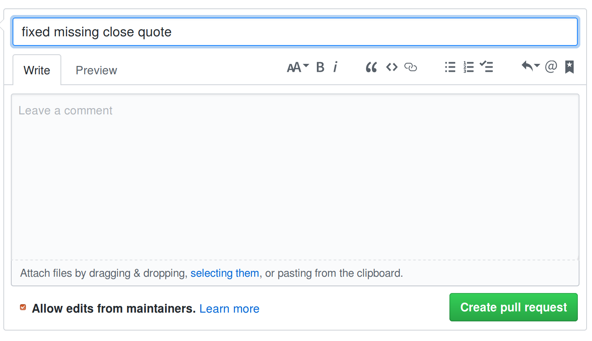
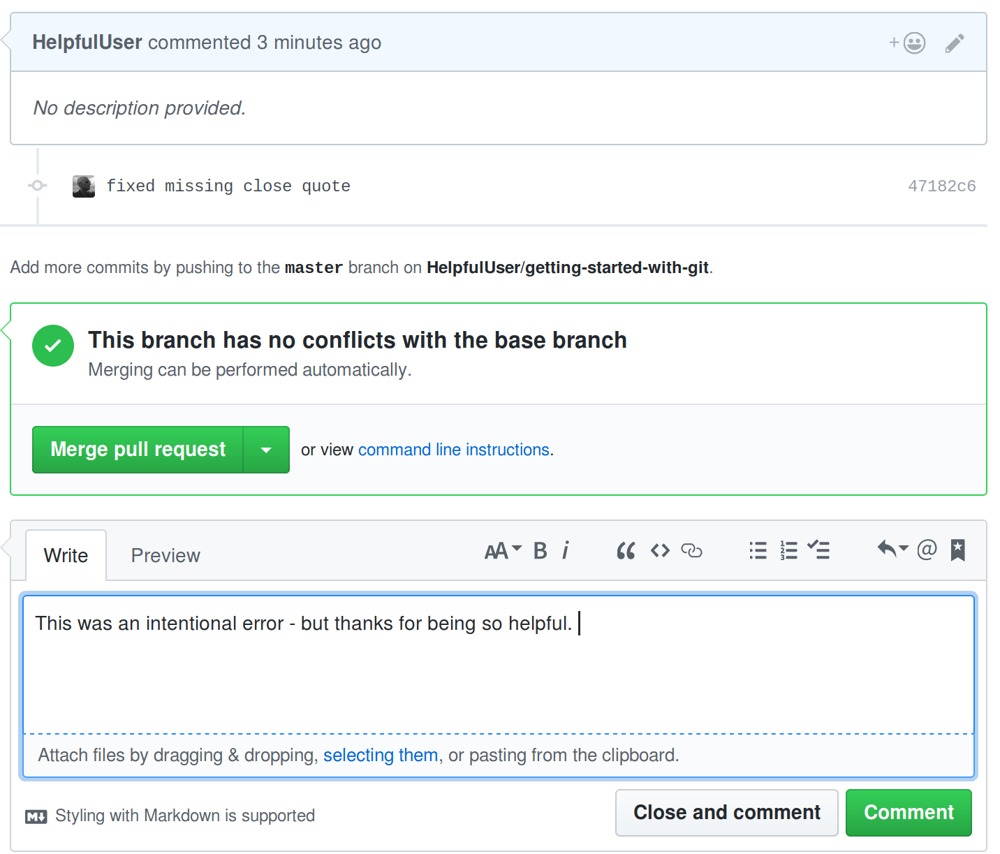

## Pull requests

Issues are great, but if you want to help out even more, then project maintainers are usually very happy for you to fix or improve projects yourself. To do this, you need to make your own copy of the repo so that you can work on it.

- On the projects main page, find the **Fork** button, and click it.

	

- You will now have a copy of the repo. You should see a **Clone or download** button. Clicking this will reveal the uniform resource identifier (URI) of the repo. Now, using the terminal, you can clone the repo to your computer with `git clone`:

	```bash
	git clone https://github.com/HelpfulUser/getting-started-with-git.git
	```

- All the files and directories will now be on your computer. Go ahead and make the changes you want, then commit them and push them back up to GitHub, just like you would normally do. Here your commit message is particularly important, as it will explain the changes you have made to the resource's original owner.

- You can now head back over to GitHub. Find the button that says **New pull request**.

	

- Click the button and then click on the **Create pull request** button.

	

- Your commit message will be there, but you can change it and even add a more detailed description if you like.

	

- Once you're happy, click the **Create pull request** button. The maintainer of the repo will then be able to see your pull request. They can then choose to merge it into their repo, or close it.

	

